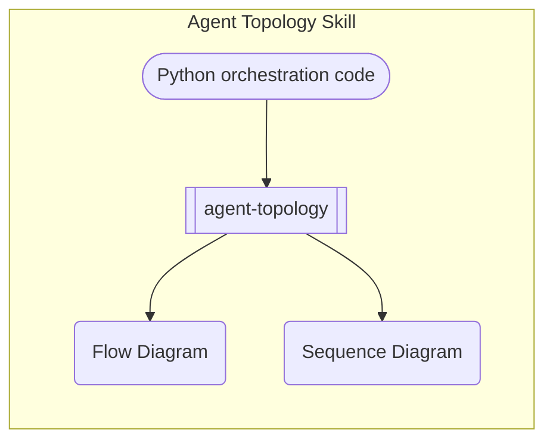
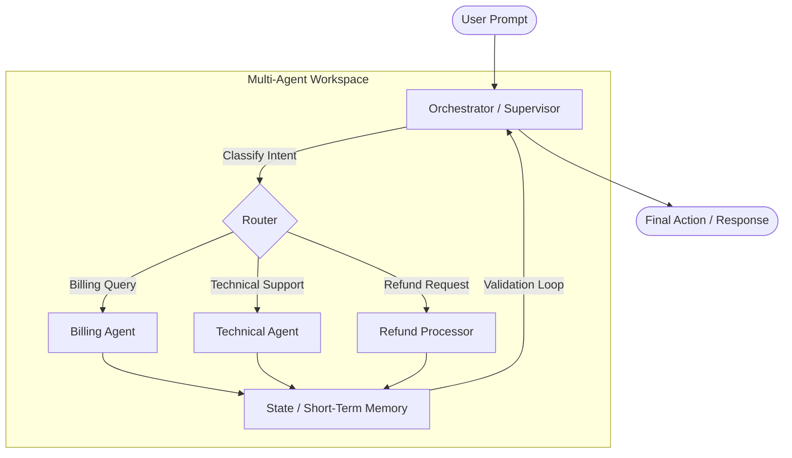

# Agent Topology

A Claude Code skill that inspects multi-agent orchestration code — LangGraph, AutoGen, or custom routing loops — and generates production-ready **Mermaid.js** system architecture diagrams directly inside your editor, without any external tooling.



---

## What it does

Point the skill at any Python file or directory that contains agent definitions, routers, or workflow graphs and it will:

- Scan for nodes, edges, entry points, and state schemas across LangGraph, AutoGen, and custom patterns
- Output a **flowchart** showing the static topology (who routes to whom, under what conditions)
- Output a **sequence diagram** showing the runtime message-passing order
- Fall back to an inline SVG for graphs with more than 30 nodes
- Never touch your source files — strictly read-only

---

## Mermaid rendering in VS Code

### Native rendering (VS Code 1.90+)

Mermaid diagrams now render **natively** in VS Code's built-in Markdown preview, Notebooks, and Copilot Chat — no extension required. Simply open any `.md` file containing a ` ```mermaid ``` ` block and hit `Ctrl+Shift+V` / `Cmd+Shift+V` to preview.

This native support is also active in:

- GitHub Markdown files and pull request descriptions
- Obsidian (built-in renderer)
- GitLab Markdown preview
- Any Claude Code chat response

### Critical: uninstall legacy Mermaid extensions

> **If you have installed a third-party Mermaid preview extension — especially the legacy standalone version by Matt Bierner (`bierner.markdown-mermaid`) — uninstall it before using this skill.**

The old extension predates VS Code's native Mermaid support and conflicts with it directly, causing:

- Diagrams that flash or fail to render on first open
- Double-rendering artefacts (the native renderer and the extension both fire)
- Blank preview panes when diagrams contain newer Mermaid syntax (`flowchart`, `sequenceDiagram` with `loop`/`alt` blocks)

**To uninstall:**

1. Open the Extensions panel (`Ctrl+Shift+X` / `Cmd+Shift+X`)
2. Search for `Markdown Preview Mermaid Support`
3. Click **Uninstall**
4. Reload VS Code

Once removed, the native renderer takes over automatically.

---

## Installation

Clone this repository directly into your global Claude skills directory:

```bash
git clone https://github.com/SoniaMehta14/agent-topology.git \
  ~/.claude/skills/agent-topology
```

That's it. Claude Code discovers skills in `~/.claude/skills/` automatically — no config file edits, no restart required.

### Verify installation

In any Claude Code session (terminal or VS Code), type:

```
/agent-topology
```

Claude will load the skill and prompt you for a target file or directory.

---

## Usage

### Slash command

```
/agent-topology
```

Claude will ask which file or directory to analyze. You can also pass a target inline:

```
/agent-topology src/agents/
```

### Natural language triggers

The skill auto-loads when your message matches any of these phrases:

| Phrase | Example |
|---|---|
| map the architecture | "map the architecture of my LangGraph pipeline" |
| visualize agents | "visualize the agents in research_graph.py" |
| trace system routing | "trace the system routing in my AutoGen setup" |
| diagram the workflow | "diagram the workflow in src/orchestrator.py" |
| show agent topology | "show the agent topology for this project" |
| draw the agent graph | "draw the agent graph for the coordinator module" |
| map data flow | "map data flow between my workers" |

---

## Supported frameworks

| Framework | Patterns detected |
|---|---|
| **LangGraph** | `StateGraph`, `add_node`, `add_edge`, `add_conditional_edges`, `set_entry_point`, `END` |
| **AutoGen** | `AssistantAgent`, `UserProxyAgent`, `GroupChat`, `GroupChatManager`, `initiate_chat` |
| **Custom** | `@node` decorators, `class *Agent`, `def *_agent()`, `return {"next": ...}` router patterns |

---

## Example output

Given a LangGraph research pipeline with a search → draft → critique loop:



---

## Repository structure

```
agent-topology/
├── README.md                   ← this file
└── agent-topology/
    └── SKILL.md                ← skill definition (frontmatter + instructions)
```

The nested `agent-topology/` directory matches Claude Code's skill discovery convention: skills are loaded from `<skills-root>/<skill-name>/SKILL.md`.

---

## License

MIT
