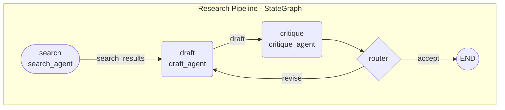
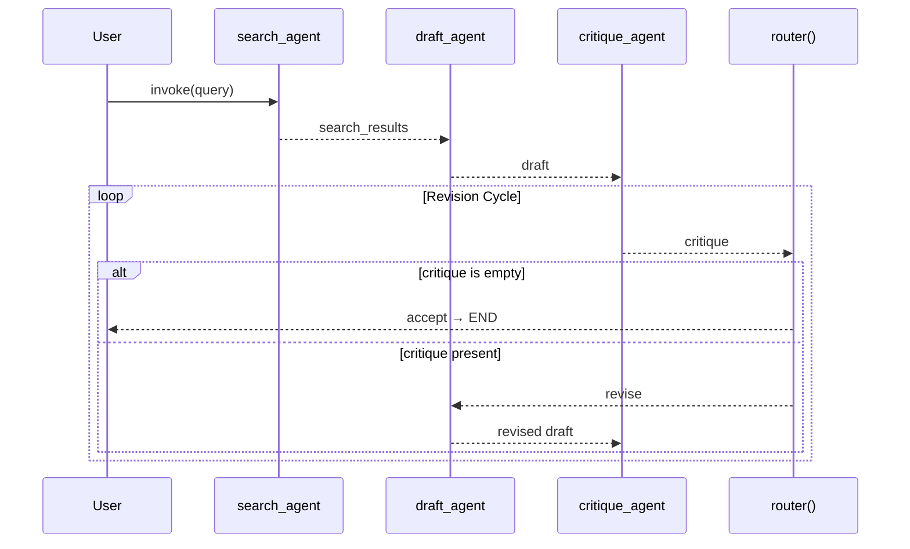

# Topology Visualizer

Generate visual, production-ready architecture diagrams from multi-agent orchestration code.
This skill is **strictly read-only** — it never modifies any source file.

---

## 1. Safety Contract

**Non-negotiable rules that apply for every invocation:**

- Open every file with **read-only** intent. Never write, patch, rename, or delete source files.
- Do not execute orchestration code, import agent modules, or start subprocesses.
- If a file requires network access or secrets to parse (e.g., remote graph configs), describe
  what you found statically and note the limitation — do not attempt to resolve credentials.
- If you are uncertain whether a file is safe to read (e.g., a `.env`, `credentials.json`,
  private key), skip it and note the omission in the diagram legend.

---

## 2. Discovery: Scanning the Workspace

When invoked, run the following discovery pass over the target workspace (or the directory the
user specifies). Use `find` and `grep` via the Bash tool in read-only mode.

### 2.1 Locate Agent Definition Files

```bash
# Find Python files that define agents, nodes, or workers
find . -type f -name "*.py" \
  | xargs grep -l \
    -e "class.*Agent" \
    -e "@node" \
    -e "add_node" \
    -e "register_agent" \
    -e "AssistantAgent\|UserProxyAgent" \
    -e "def.*_agent\b" \
  2>/dev/null
```

### 2.2 Locate Router / Orchestrator Files

```bash
# Find files containing routing or conditional edge logic
find . -type f -name "*.py" \
  | xargs grep -l \
    -e "add_conditional_edges\|add_edge" \
    -e "StateGraph\|MessageGraph" \
    -e "Router\|router\|route_message\|dispatch" \
    -e "initiate_chat\|GroupChat\|GroupChatManager" \
  2>/dev/null
```

### 2.3 Locate Channel / State Schema Files

```bash
# Find TypedDict, dataclass, Pydantic models used as state or message types
find . -type f -name "*.py" \
  | xargs grep -l \
    -e "TypedDict\|BaseModel\|dataclass" \
    -e "MessagesState\|AgentState\|State" \
  2>/dev/null
```

### 2.4 Ranking Priority

Process discovered files in this order:

1. Files matching `*graph*`, `*workflow*`, `*orchestrat*`, `*topology*`, `*pipeline*`
2. Files matching `*router*`, `*dispatch*`, `*coordinator*`
3. Files matching `*agent*`, `*worker*`, `*node*`
4. All remaining `.py` files that matched any grep above

---

## 3. Parsing: Extracting the Topology

For each file in the priority list, extract the following structural elements by reading the
source — **do not execute the code**.

### 3.1 Nodes (Agents / Workers)

Identify every logical unit that processes messages or state:

| Pattern | Framework | What to Extract |
|---|---|---|
| `graph.add_node("name", fn)` | LangGraph | Node name + handler function |
| `StateGraph(State)` | LangGraph | State schema name |
| `class MyAgent(ConversableAgent)` | AutoGen | Class name + `system_message` if present |
| `AssistantAgent(name="x", ...)` | AutoGen | `name` kwarg |
| `@node` decorator | Custom | Decorated function name |
| `def <name>_agent(state)` | Custom | Function name, inferred as agent |

### 3.2 Edges (Data Flow)

| Pattern | Framework | What to Extract |
|---|---|---|
| `graph.add_edge("a", "b")` | LangGraph | Directed edge a → b |
| `graph.add_conditional_edges("a", router_fn, {"x": "b", "y": "c"})` | LangGraph | Conditional fan-out from a |
| `groupchat = GroupChat(agents=[a, b, c])` | AutoGen | Peer mesh among listed agents |
| `a.initiate_chat(b, ...)` | AutoGen | Directed edge a → b |
| Explicit `return {"next": "agent_name"}` inside a router function | Custom | Conditional routing target |

### 3.3 Entry / Exit Points

- **Entry**: `graph.set_entry_point("name")` or the first node added / first `initiate_chat` caller.
- **Exit**: `graph.add_edge("name", END)` or `END` / `FINISH` sentinel references. Mark these
  with a terminal node in the diagram.

### 3.4 State / Message Channels

Extract field names from the state `TypedDict` or `BaseModel` that is passed to `StateGraph`.
These become labeled annotations on edges in the sequence diagram variant.

---

## 4. Output: Diagram Generation

Always produce **two complementary diagrams** unless the user asks for only one:

1. **Flow Diagram** — static topology (nodes + edges + conditionals)
2. **Sequence Diagram** — runtime message passing order (inferred from entry point traversal)

Wrap all diagrams in fenced ` ```mermaid ``` ` blocks so they render natively in VS Code,
GitHub, Obsidian, and standard markdown viewers without any external layout engine.

### 4.1 Flow Diagram Rules

- Use `flowchart TD` (top-down) for linear pipelines; use `flowchart LR` (left-right) for
  peer meshes with many lateral connections.
- Every node gets a **short label** (`NodeName\nhandler_fn`) and a **shape**:
  - Rounded rectangle `(NodeName)` → regular agent / worker
  - Stadium shape `([NodeName])` → entry point
  - Double rectangle `[[NodeName]]` → router / coordinator
  - Circle `((NodeName))` → terminal / END node
- Conditional edges use labeled arrows: `A -->|condition_key| B`
- Group related agents inside `subgraph Framework [FrameworkName]` blocks.
- Add a `%% Legend` comment block at the bottom.

### 4.2 Sequence Diagram Rules

- Use `sequenceDiagram` with `participant` declarations in execution order.
- Show state field names as message labels: `Router->>Worker: invoke(messages, context)`
- Use `alt` / `else` blocks for conditional branches.
- Use `loop` blocks for retry or reflection loops.
- Mark async calls with `-->>` (dashed arrow).

### 4.3 Inline SVG Fallback

If the diagram has more than 30 nodes (too dense for Mermaid auto-layout), produce a compact
inline SVG instead. Use a grid layout: routers in the center row, workers radiating outward.
Keep SVG self-contained — no external `href` or `xlink` references.

---

## 5. Few-Shot Examples

### Example A: LangGraph Research Pipeline

**Input — `research_graph.py`:**

```python
from langgraph.graph import StateGraph, END
from typing import TypedDict, Annotated
import operator

class ResearchState(TypedDict):
    query: str
    search_results: list[str]
    draft: str
    critique: str
    messages: Annotated[list, operator.add]

def search_agent(state: ResearchState) -> ResearchState:
    """Searches the web for the query."""
    ...

def draft_agent(state: ResearchState) -> ResearchState:
    """Writes a draft based on search results."""
    ...

def critique_agent(state: ResearchState) -> ResearchState:
    """Reviews the draft and provides critique."""
    ...

def router(state: ResearchState) -> str:
    if len(state["critique"]) == 0:
        return "accept"
    return "revise"

graph = StateGraph(ResearchState)
graph.add_node("search", search_agent)
graph.add_node("draft", draft_agent)
graph.add_node("critique", critique_agent)
graph.set_entry_point("search")
graph.add_edge("search", "draft")
graph.add_edge("draft", "critique")
graph.add_conditional_edges("critique", router, {"accept": END, "revise": "draft"})
```

**Expected Flow Diagram Output:**

````markdown

````

**Expected Sequence Diagram Output:**

````markdown

````

---

### Example B: AutoGen GroupChat with a Manager

**Input — `autogen_team.py`:**

```python
import autogen

config_list = [{"model": "gpt-4o", "api_key": "..."}]
llm_config = {"config_list": config_list}

planner = autogen.AssistantAgent(
    name="Planner",
    system_message="You break tasks into subtasks.",
    llm_config=llm_config,
)
coder = autogen.AssistantAgent(
    name="Coder",
    system_message="You write Python code.",
    llm_config=llm_config,
)
reviewer = autogen.AssistantAgent(
    name="Reviewer",
    system_message="You review code for correctness.",
    llm_config=llm_config,
)
user_proxy = autogen.UserProxyAgent(
    name="UserProxy",
    human_input_mode="TERMINATE",
    code_execution_config={"work_dir": "workspace"},
)
groupchat = autogen.GroupChat(
    agents=[user_proxy, planner, coder, reviewer],
    messages=[],
    max_round=10,
)
manager = autogen.GroupChatManager(groupchat=groupchat, llm_config=llm_config)
user_proxy.initiate_chat(manager, message="Build a web scraper.")
```

**Expected Flow Diagram Output:**

````markdown
```mermaid
flowchart LR
    subgraph AutoGen [AutoGen GroupChat · max_round=10]
        UP([UserProxy\nhuman_input_mode=TERMINATE])
        PL(Planner\n"Break tasks into subtasks")
        CO(Coder\n"Write Python code")
        RE(Reviewer\n"Review code for correctness")
        MG[[GroupChatManager\norchestrates speaker selection]]
    end

    UP -->|initiate_chat| MG
    MG <-->|route| PL
    MG <-->|route| CO
    MG <-->|route| RE
    MG -->|TERMINATE| UP

%% Legend
%% ([x]) = Entry/UserProxy   [[x]] = Manager/Router
%% (x)   = AssistantAgent    <--> = bidirectional via manager
%% max_round: 10
```
````

---

### Example C: Custom Router with Fanout

**Input — `custom_router.py`:**

```python
class OrchestratorAgent:
    def route(self, message: dict) -> str:
        intent = message.get("intent")
        if intent == "search":
            return "search_worker"
        elif intent == "summarize":
            return "summary_worker"
        else:
            return "fallback_worker"

class SearchWorker:
    def run(self, message: dict) -> dict: ...

class SummaryWorker:
    def run(self, message: dict) -> dict: ...

class FallbackWorker:
    def run(self, message: dict) -> dict: ...
```

**Expected Flow Diagram Output:**

````markdown
```mermaid
flowchart TD
    subgraph Custom [Custom Router Architecture]
        IN([Incoming Message])
        OR[[OrchestratorAgent\nroute\(\)])
        SW(SearchWorker\nrun\(\))
        SU(SummaryWorker\nrun\(\))
        FB(FallbackWorker\nrun\(\))
        OUT((Response))
    end

    IN --> OR
    OR -->|intent == search| SW
    OR -->|intent == summarize| SU
    OR -->|else| FB
    SW --> OUT
    SU --> OUT
    FB --> OUT

%% Legend
%% Routing key: message["intent"]
%% Workers: SearchWorker, SummaryWorker, FallbackWorker
```
````

---

## 6. Output Format & Delivery

Structure every response in this order:

```
## Agent Topology: <WorkspaceName or filename>

### Discovered Components
- **Nodes (N):** <count> agents/workers
- **Edges (E):** <count> directed / <count> conditional
- **Framework:** LangGraph | AutoGen | Custom | Mixed
- **Entry point:** <name>
- **Terminal(s):** <name(s)>
- **State schema:** <TypedDict/BaseModel name> with fields: <field list>

---

### Flow Diagram

\```mermaid
...
\```

---

### Sequence Diagram

\```mermaid
...
\```

---

### Notes & Limitations
- <any ambiguities, skipped files, inferred vs. confirmed edges>
```

---

## 7. Ambiguity Handling

| Situation | Action |
|---|---|
| Dynamic node registration (`add_node` inside a loop) | Draw a representative node labeled `<dynamic: N nodes>` and add a note |
| Routing function calls an LLM to decide next agent | Label the edge `LLM-decided` with a dashed arrow `-.->` |
| Agent class defined in an imported module not in workspace | Draw the node with a dashed border using `:::external` CSS class |
| Circular reference / detected cycle | Draw the cycle with a back-edge and label it `loop` |
| File is a test, mock, or fixture | Skip it; note in the "Notes & Limitations" section |
| Entry point ambiguous | Assume the first `add_node` call or the first class instantiated is the entry; note assumption |

Define the external class in the Mermaid output:

```
classDef external fill:#f5f5f5,stroke:#999,stroke-dasharray: 5 5
```

---

## 8. Invocation Checklist

Before generating the diagram, confirm:

- [ ] Target directory or file has been identified (ask user if ambiguous)
- [ ] Discovery scan completed (all three `find` + `grep` passes)
- [ ] No write operations attempted on any source file
- [ ] Both flow and sequence diagrams drafted
- [ ] Node count verified (switch to SVG if >30)
- [ ] Notes section captures all ambiguities and skipped files
- [ ] Mermaid blocks are valid (no unclosed brackets, no unsupported syntax)
